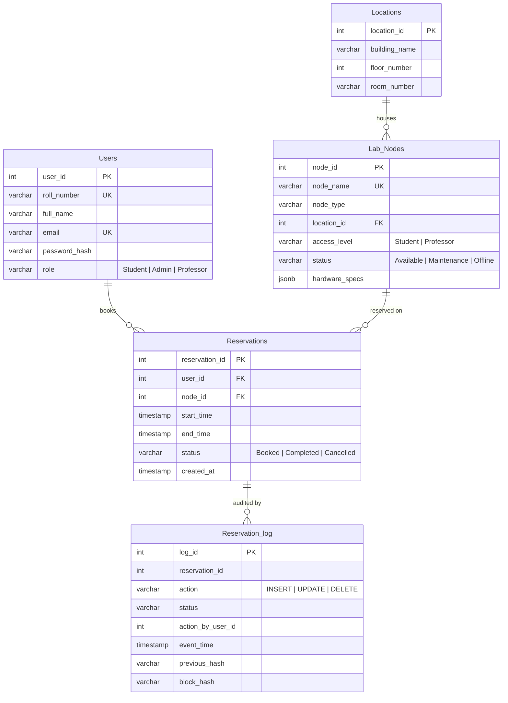
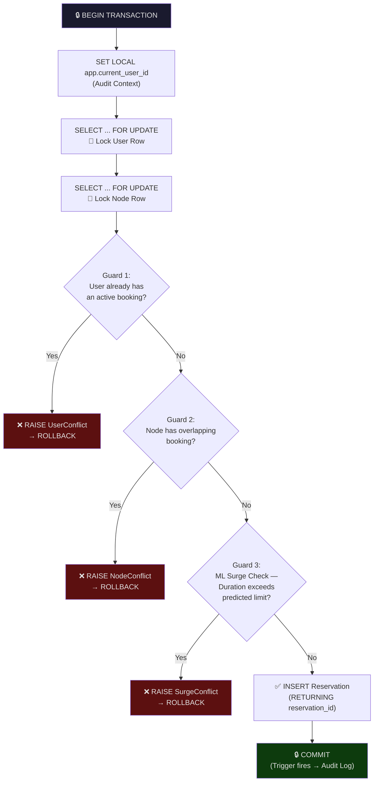
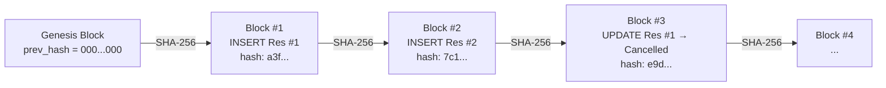
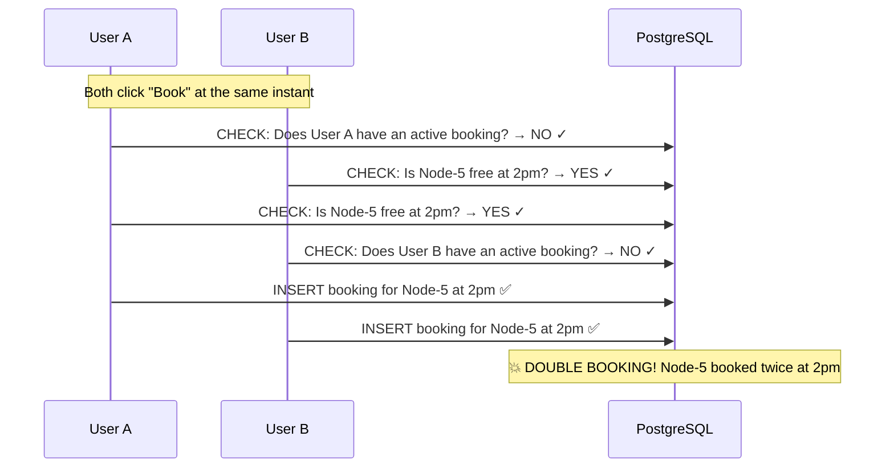
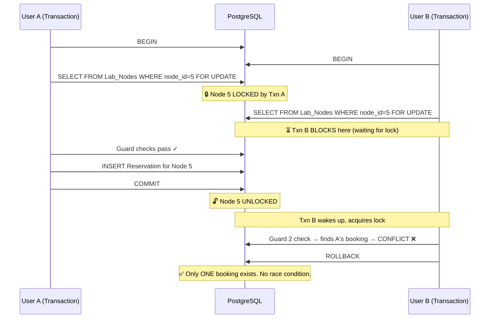

# Silicon-Scheduler
---

## Table of Contents

1. [Database Schema Overview](#1-database-schema-overview)
2. [Authentication & User Queries](#2-authentication--user-queries)
3. [Infrastructure Queries](#3-infrastructure-queries)
4. [Core Booking Logic (with Race Condition Handling)](#4-core-booking-logic--race-condition-handling)
5. [Retrieval Queries](#5-retrieval-queries)
6. [Cancellation & Admin Mutations](#6-cancellation--admin-mutations)
7. [Cryptographic Audit Ledger](#7-cryptographic-audit-ledger)
8. [ML Training Pipeline Query](#8-ml-training-pipeline-query)
9. [How Race Conditions Are Solved — Deep Dive](#9-how-race-conditions-are-solved--deep-dive)

---

## 1. Database Schema Overview



### Key Constraints & Indexes

| Constraint / Index | Purpose |
|---|---|
| `CHECK (end_time > start_time)` | Prevents invalid time ranges at the DB level |
| `CHECK (role IN ('Student','Admin','Professor'))` | Enforces role enumeration |
| `CHECK (status IN ('Available','Maintenance','Offline'))` | Enforces node status enumeration |
| `idx_res_time_range` (B-tree on `start_time, end_time`) | Speeds up overlap queries for availability checks |
| `idx_res_user` (B-tree on `user_id`) | Speeds up "my bookings" lookup |
| `idx_res_node` (B-tree on `node_id`) | Speeds up node conflict checks |
| `ON DELETE CASCADE` on Reservations | If a user/node is deleted, their reservations are auto-removed |
| `ON DELETE RESTRICT` on Lab_Nodes → Locations | Prevents deleting a location that still has nodes |

---

## 2. Authentication & User Queries

### 2.1 Register User

```sql
INSERT INTO Users (roll_number, full_name, email, password_hash, role)
VALUES (:roll, :name, :email, :pw, :role)
RETURNING user_id, roll_number, full_name, email, role;
```

| Aspect | Detail |
|---|---|
| **Purpose** | Creates a new user account |
| **RETURNING clause** | Immediately returns the created user's data without a second SELECT — avoids an extra round-trip |
| **Integrity Protection** | `roll_number` and `email` have UNIQUE constraints. If violated, PostgreSQL raises `IntegrityError`, caught by FastAPI to return HTTP 400 |
| **Security** | Password is bcrypt-hashed *before* this query runs (in `main.py`). The raw password never touches the database |

### 2.2 Login Lookup

```sql
SELECT * FROM Users WHERE roll_number = :roll;
```

| Aspect | Detail |
|---|---|
| **Purpose** | Fetches the full user record (including `password_hash`) for credential verification |
| **Why `SELECT *`?** | We need `password_hash` for bcrypt comparison AND `user_id`, `role` for JWT token creation |
| **Post-query logic** | Python calls `bcrypt.checkpw()` to compare the submitted password against the stored hash |

### 2.3 Get All Users (Admin)

```sql
SELECT user_id, roll_number, full_name, email, role
FROM Users ORDER BY full_name;
```

| Aspect | Detail |
|---|---|
| **Purpose** | Admin dashboard — lists all registered users |
| **Selective columns** | Explicitly excludes `password_hash` — never exposes secrets to the frontend |
| **Ordering** | Alphabetical by name for consistent UI rendering |

---

## 3. Infrastructure Queries

### 3.1 Get All Locations

```sql
SELECT * FROM Locations;
```

| Aspect | Detail |
|---|---|
| **Purpose** | Populates the location dropdown in the Booking Wizard |
| **Simple full scan** | The Locations table is small (< 20 rows), so no filtering or indexing is needed |

### 3.2 Get Nodes at a Location

```sql
SELECT * FROM Lab_Nodes WHERE location_id = :loc;
```

| Aspect | Detail |
|---|---|
| **Purpose** | After user selects a location, show all hardware nodes at that location |
| **Returns all statuses** | Includes `Available`, `Maintenance`, and `Offline` nodes — the frontend uses this to gray out non-available nodes |

### 3.3 Get Available Nodes (Temporal Overlap Check) ⭐

```sql
SELECT * FROM Lab_Nodes
WHERE status = 'Available'
AND node_id NOT IN (
    SELECT node_id FROM Reservations
    WHERE status = 'Booked'
    AND (start_time < CAST(:end AS TIMESTAMP)
         AND end_time > CAST(:start AS TIMESTAMP))
)
AND location_id = :loc;   -- optional filter
```

| Aspect | Detail |
|---|---|
| **Purpose** | The core availability engine — finds nodes with zero booking conflicts in the requested time window |
| **Overlap detection formula** | Two intervals `[A_start, A_end)` and `[B_start, B_end)` overlap if and only if `A_start < B_end AND A_end > B_start`. This is the standard interval overlap condition used in scheduling systems |
| **`NOT IN` subquery** | Excludes any node that has even one overlapping "Booked" reservation |
| **`status = 'Available'`** | Pre-filters out nodes under Maintenance or Offline — they can't be booked regardless |
| **`CAST(:end AS TIMESTAMP)`** | Ensures string-to-timestamp conversion happens at the DB level for type safety |
| **Index used** | `idx_res_time_range` on `(start_time, end_time)` makes the subquery efficient |

> [!TIP]
> **Why this overlap formula works:** If you think of time as a number line, two intervals overlap unless one ends before the other starts. So `NOT overlapping = (A_end ≤ B_start) OR (A_start ≥ B_end)`. Negating this gives us: `A_start < B_end AND A_end > B_start`.

---

## 4. Core Booking Logic — Race Condition Handling

This is the most critical function in the system: `book_hardware()`. It runs inside a **single atomic transaction** (`engine.begin()`) with **five sequential guards**.



### Step-by-step breakdown:

### 4.1 Inject Audit Context

```sql
SET LOCAL app.current_user_id = :uid;
```

| Aspect | Detail |
|---|---|
| **Purpose** | Stores the acting user's ID in a PostgreSQL session variable so the database trigger (which fires on INSERT/UPDATE) can read it and record *who* performed the action in the audit log |
| **`SET LOCAL`** | Scoped to the current transaction only — automatically cleared on COMMIT/ROLLBACK. This is critical for multi-user concurrency: each transaction gets its own isolated value |

### 4.2 Row-Level Locking (Race Condition Prevention) 🔐

```sql
-- Lock the User row
SELECT user_id FROM Users WHERE user_id = :user FOR UPDATE;

-- Lock the Node row
SELECT node_id FROM Lab_Nodes WHERE node_id = :node FOR UPDATE;
```

| Aspect | Detail |
|---|---|
| **Purpose** | **This is the primary race condition defense.** `FOR UPDATE` acquires an exclusive row-level lock on the selected rows |
| **Effect** | Any other transaction trying to `SELECT ... FOR UPDATE` on the same user or same node will **block and wait** until this transaction commits or rolls back |
| **Why lock both?** | Locking the User row prevents the same user from double-booking simultaneously. Locking the Node row prevents two users from booking the same node at the same time |
| **Not a table lock** | Only the specific rows are locked — other users booking different nodes are unaffected (high concurrency) |

> [!IMPORTANT]
> **Without `FOR UPDATE`**, two simultaneous requests could both pass the "user has no active booking" check, then both INSERT — resulting in a user with 2 active bookings. This is the classic **TOCTOU (Time-of-Check-to-Time-of-Use)** race condition.

### 4.3 Guard 1 — Max 1 Active Booking Per User

```sql
SELECT reservation_id FROM Reservations
WHERE user_id = :user
  AND status = 'Booked'
  AND end_time > CURRENT_TIMESTAMP
FOR UPDATE;
```

| Aspect | Detail |
|---|---|
| **Purpose** | Enforces the business rule: each user can have at most ONE active (future/ongoing) booking |
| **`end_time > CURRENT_TIMESTAMP`** | Only considers bookings that haven't ended yet |
| **`FOR UPDATE`** | Also locks any found reservation rows, preventing a concurrent cancellation from creating a loophole where the check passes right as another transaction cancels |
| **If rows found** | Raises `ValueError("UserConflict")` → FastAPI returns HTTP 409 |

### 4.4 Guard 2 — Node Temporal Overlap Check

```sql
SELECT reservation_id FROM Reservations
WHERE node_id = :node
  AND status = 'Booked'
  AND start_time < CAST(:end AS TIMESTAMP)
  AND end_time > CAST(:start AS TIMESTAMP)
FOR UPDATE;
```

| Aspect | Detail |
|---|---|
| **Purpose** | Prevents double-booking a node for overlapping time slots |
| **Same overlap formula** | Uses the standard interval intersection test: `A.start < B.end AND A.end > B.start` |
| **`FOR UPDATE`** | Locks conflicting reservations so no concurrent transaction can cancel them and sneak through |
| **If rows found** | Raises `ValueError("NodeConflict")` → FastAPI returns HTTP 409 |

### 4.5 Guard 3 — ML Surge Prediction Check

```sql
-- Fetches node metadata for ML inference
SELECT node_type, location_id FROM Lab_Nodes WHERE node_id = :nid;
```

| Aspect | Detail |
|---|---|
| **Purpose** | Feeds the Gradient Boosting model to predict current load for the requested time slot |
| **ML Logic** | The model returns a predicted utilization (0.0–1.0). Based on this, a dynamic duration cap is enforced |
| **Surge tiers** | Load > 80% → max 1 hour, Load > 50% → max 4 hours, Load ≤ 50% → max 8 hours |
| **If exceeded** | Raises `ValueError("SurgeConflict:N")` → HTTP 409 with the allowed hours |

### 4.6 Final Insertion

```sql
INSERT INTO Reservations (user_id, node_id, start_time, end_time, status)
VALUES (:user, :node, CAST(:start AS TIMESTAMP), CAST(:end AS TIMESTAMP), 'Booked')
RETURNING reservation_id;
```

| Aspect | Detail |
|---|---|
| **Purpose** | Creates the reservation record after all guards pass |
| **`RETURNING`** | Returns the auto-generated `reservation_id` to the client without an extra query |
| **DB-level safety net** | Even if application logic fails, the `CHECK (end_time > start_time)` constraint prevents invalid time ranges |
| **Trigger fires** | On INSERT, a PostgreSQL trigger automatically writes a blockchain-hashed entry to `Reservation_log` |

---

## 5. Retrieval Queries

### 5.1 Get My Bookings

```sql
SELECT r.*, n.node_name, n.node_type, n.location_id, l.building_name,
  CASE
    WHEN r.status = 'Booked' AND r.end_time <= CURRENT_TIMESTAMP
    THEN 'Completed'
    ELSE r.status
  END AS status
FROM Reservations r
JOIN Lab_Nodes n ON r.node_id = n.node_id
JOIN Locations l ON n.location_id = l.location_id
WHERE r.user_id = :user
ORDER BY r.start_time DESC
LIMIT 100;
```

| Aspect | Detail |
|---|---|
| **Purpose** | User dashboard — shows the logged-in user's booking history |
| **3-table JOIN** | `Reservations → Lab_Nodes → Locations` to show human-readable node names and building names |
| **`CASE` expression** | **Virtual status upgrade:** if a booking's end_time has passed but wasn't explicitly updated, it's displayed as "Completed" on-the-fly. This avoids needing a cron job to expire bookings |
| **`ORDER BY start_time DESC`** | Most recent bookings first |
| **`LIMIT 100`** | Prevents memory blow-up for users with extensive history |

### 5.2 Get All Bookings (Admin)

```sql
SELECT r.*, u.full_name, u.roll_number, u.role,
       n.node_name, n.node_type, l.building_name,
  CASE
    WHEN r.status = 'Booked' AND r.end_time <= CURRENT_TIMESTAMP
    THEN 'Completed'
    ELSE r.status
  END AS status
FROM Reservations r
JOIN Users u ON r.user_id = u.user_id
JOIN Lab_Nodes n ON r.node_id = n.node_id
JOIN Locations l ON n.location_id = l.location_id
WHERE r.status = :filter   -- optional
ORDER BY r.start_time DESC
LIMIT 200;
```

| Aspect | Detail |
|---|---|
| **Purpose** | Admin "Global Ledger" — shows all reservations across the system |
| **4-table JOIN** | Also joins `Users` to display who booked what |
| **Same CASE trick** | Auto-marks expired bookings as "Completed" |
| **Optional WHERE** | Filters by status when the admin toggles tabs (Booked / Cancelled / etc.) |
| **`LIMIT 200`** | Hard cap to prevent admin dashboard crashes on large datasets |

---

## 6. Cancellation & Admin Mutations

### 6.1 Cancel Booking

```sql
SET LOCAL app.current_user_id = :uid;  -- audit trail

UPDATE Reservations
SET status = 'Cancelled'
WHERE reservation_id = :id;
```

| Aspect | Detail |
|---|---|
| **Purpose** | Admin cancels a reservation — marks it as "Cancelled" rather than deleting it (preserving history) |
| **Soft delete pattern** | No data is destroyed; the record remains for audit and compliance |
| **`SET LOCAL`** | Same audit context trick — the trigger records which admin performed the cancellation |

### 6.2 Add Node (Admin)

```sql
INSERT INTO Lab_Nodes (node_name, node_type, location_id, access_level, hardware_specs, status)
VALUES (:name, :type, :loc, :access, :specs, :status);
```

| Aspect | Detail |
|---|---|
| **Purpose** | Admin provisions a new hardware node |
| **`hardware_specs`** | Stored as JSONB — flexible schema for varying hardware (GPU VRAM, CPU cores, etc.) |
| **`UNIQUE(node_name)`** | Prevents duplicate node names |

### 6.3 Delete Node (Admin)

```sql
DELETE FROM Lab_Nodes WHERE node_id = :id;
```

| Aspect | Detail |
|---|---|
| **Purpose** | Permanently removes a node from the system |
| **Cascade effect** | Due to `ON DELETE CASCADE` on Reservations, all bookings for this node are also deleted |

---

## 7. Cryptographic Audit Ledger

### 7.1 How It Works — Blockchain-Style Hash Chain

Every INSERT/UPDATE/DELETE on the `Reservations` table fires a **PostgreSQL trigger** that:

1. Reads the `previous_hash` from the last entry in `Reservation_log`
2. Constructs a payload: `{previous_hash}{reservation_id}{action}{status}{user_id}`
3. Computes `SHA-256(payload)` → stores as `block_hash`
4. The session variable `app.current_user_id` (set via `SET LOCAL`) tells the trigger *who* did it



### 7.2 Full Security Audit Query

```sql
-- Step 1: Read the entire chain
SELECT * FROM Reservation_log ORDER BY log_id ASC;

-- Step 2: Read current state of all reservations
SELECT reservation_id, status FROM Reservations;
```

| Aspect | Detail |
|---|---|
| **Purpose** | The `run_full_security_audit()` function performs two integrity checks |

**Check 1 — Cryptographic Chain Integrity:**

```python
prev_hash = '0000...0000'  # Genesis hash (64 zeros)
for block in logs:
    payload = f"{prev_hash}{res_id}{action}{status}{action_by}"
    computed = sha256(payload)
    if computed != block['block_hash']:
        → CRYPTOGRAPHIC_FRACTURE detected!
    prev_hash = block['block_hash']
```

> If any log row has been tampered with (manually edited in the DB), the hash chain breaks and the audit immediately flags it.

**Check 2 — State Desynchronization Detection:**

```python
for res_id, logged_status in ledger_final_states.items():
    actual = db_states[res_id]
    if actual != logged_status:
        → STATE_DESYNC_MUTATION detected!
```

> If someone directly UPDATEs a reservation's status via `psql` (bypassing the app), the audit log's last recorded state won't match the database — caught immediately.

### Audit Anomaly Types

| Anomaly | Meaning |
|---|---|
| `CRYPTOGRAPHIC_FRACTURE` | A log entry's hash doesn't match recomputation — **data was tampered with** |
| `STATE_DESYNC_GHOST` | The log says a reservation exists, but it's missing from the DB — **unauthorized DELETE** |
| `STATE_DESYNC_MUTATION` | The log says status is "Booked" but DB says "Cancelled" (or vice versa) — **unauthorized UPDATE** |

---

## 8. ML Training Pipeline Query

This complex CTE (Common Table Expression) query runs in `train_model.py` to generate training data:

```sql
WITH Time_Skeleton AS (
    -- Generate every hourly slot for the past 180 days
    SELECT generate_series(
        CURRENT_DATE - INTERVAL '180 days',
        CURRENT_DATE,
        INTERVAL '1 hour'
    ) AS slot
),
Node_Configs AS (
    -- All unique (node_type, location) combinations
    SELECT DISTINCT node_type, location_id FROM Lab_Nodes
),
Capacity AS (
    -- How many nodes of each type exist at each location
    SELECT node_type, location_id, COUNT(*) as total_nodes
    FROM Lab_Nodes GROUP BY node_type, location_id
),
Hourly_Usage AS (
    -- For each hour × node_type × location: count active bookings
    SELECT
        ts.slot,
        nc.node_type,
        nc.location_id,
        COUNT(r.reservation_id) as active_bookings
    FROM Time_Skeleton ts
    CROSS JOIN Node_Configs nc
    LEFT JOIN Reservations r ON r.node_id IN (
        SELECT node_id FROM Lab_Nodes
        WHERE node_type = nc.node_type AND location_id = nc.location_id
    )
    AND ts.slot >= r.start_time AND ts.slot < r.end_time
    GROUP BY ts.slot, nc.node_type, nc.location_id
)
SELECT
    EXTRACT(ISODOW FROM h.slot) as day_of_week,  -- 1=Monday ... 7=Sunday
    EXTRACT(HOUR FROM h.slot) as hour_of_day,
    h.location_id,
    h.node_type,
    LEAST(h.active_bookings::FLOAT / NULLIF(c.total_nodes, 0), 1.0) as utilization_rate
FROM Hourly_Usage h
JOIN Capacity c ON h.node_type = c.node_type AND h.location_id = c.location_id;
```

### CTE Breakdown

| CTE | What It Does |
|---|---|
| **Time_Skeleton** | Generates ~4,320 hourly time slots (180 days × 24 hours) as a complete grid |
| **Node_Configs** | Gets all unique `(node_type, location_id)` pairs — these are the "categories" we predict for |
| **Capacity** | Counts how many physical nodes exist per category (denominator for utilization) |
| **Hourly_Usage** | `CROSS JOIN` creates every possible `(hour × category)` combination, then `LEFT JOIN` counts how many reservations were active during each slot |
| **Final SELECT** | Computes `utilization_rate = active_bookings / total_nodes`, capped at 1.0 via `LEAST()`. Uses `ISODOW` for ISO day-of-week (1=Mon, 7=Sun) to align with the ML model's expectations |

> [!NOTE]
> **`NULLIF(c.total_nodes, 0)`** prevents division-by-zero if a category has no nodes. The result would be NULL (safely handled by the ML pipeline).

---

## 9. How Race Conditions Are Solved — Deep Dive

### The Problem

In a multi-user web application, **two HTTP requests can arrive simultaneously**. Without protection:



This is the **TOCTOU (Time-of-Check-to-Time-of-Use)** problem — the state changes between when you check it and when you act on it.

### The Solution: `SELECT ... FOR UPDATE` + Atomic Transactions

Silicon Scheduler uses **three layers of defense**:

#### Layer 1: Atomic Transaction (`engine.begin()`)

All operations in `book_hardware()` execute inside a single PostgreSQL transaction. Either **everything commits** or **everything rolls back**. There is no partial state.

#### Layer 2: `SELECT ... FOR UPDATE` (Row-Level Pessimistic Locking)

```sql
SELECT user_id FROM Users WHERE user_id = :user FOR UPDATE;
SELECT node_id FROM Lab_Nodes WHERE node_id = :node FOR UPDATE;
```

**What `FOR UPDATE` does:**
- Acquires an **exclusive row-level lock** on the selected row
- Any other transaction that tries to lock the **same row** is **blocked** until this transaction finishes
- Different rows are NOT blocked — concurrency is preserved for unrelated bookings

#### Layer 3: Guard Queries with `FOR UPDATE`

Even the guard checks use `FOR UPDATE`:

```sql
-- Guard 1: Lock any active bookings by this user
SELECT ... FROM Reservations WHERE user_id = :user AND status = 'Booked' FOR UPDATE;

-- Guard 2: Lock any overlapping bookings on this node
SELECT ... FROM Reservations WHERE node_id = :node AND status = 'Booked'
  AND <overlap condition> FOR UPDATE;
```

This prevents a subtle edge case: a concurrent **cancellation** could remove the conflict right after the check, creating a window for double-booking.

### With Locking — What Actually Happens



### Summary: Defense-in-Depth

| Layer | Mechanism | What It Prevents |
|---|---|---|
| **1. Atomic Transaction** | `engine.begin()` / auto-ROLLBACK on exception | Partial writes — no half-created bookings |
| **2. Row Locks on User + Node** | `SELECT ... FOR UPDATE` on Users and Lab_Nodes | Concurrent booking attempts for the same user or same node are serialized (forced to run one-at-a-time) |
| **3. Guard Queries with `FOR UPDATE`** | `FOR UPDATE` on Reservation rows in guard checks | Prevents TOCTOU: a concurrent cancellation can't remove the conflict between the CHECK and the INSERT |
| **4. DB Constraints** | `CHECK (end_time > start_time)`, `UNIQUE`, `NOT NULL` | Last line of defense — even if app logic has a bug, the DB rejects invalid data |
| **5. Audit Ledger** | Blockchain-hashed `Reservation_log` | Post-facto detection — even if someone bypasses the app and edits the DB directly, the audit catches it |

> [!CAUTION]
> **Why not just use `SERIALIZABLE` isolation?** While PostgreSQL's `SERIALIZABLE` isolation level would also prevent anomalies, it uses **optimistic concurrency control** (allows parallel execution, then checks for conflicts at COMMIT). This means failed transactions must be **retried** by the application. The `FOR UPDATE` approach is **pessimistic** — it blocks upfront, so the INSERT always succeeds if the guards pass. For a booking system where users expect immediate feedback, pessimistic locking provides a better UX.
